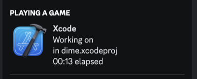

# Discord Rich Presence for Xcode

<p align="center">
  
</p>

## Features

- Launched in the background at login
- No menu bar icon nor dock icon
- Presence only when Xcode is running with a project open
- Shows respective logos when editing [known files](#supported-file-types) and
  Xcode icon otherwise
- Written 100% in Rust

## Getting Started

### Installation with Homebrew

```bash
brew tap izyumidev/xcode-discord-rpc
brew install xcode-discord-rpc
brew services restart xcode-discord-rpc
```

If things are not working, restart Discord and/or your computer.

### Uninstallation

```bash
brew services stop xcode-discord-rpc
brew uninstall xcode-discord-rpc
brew untap izyumidev/xcode-discord-rpc
```

## Supported File Types

- `.swift`
- `.cpp`, `.cp`, `cxx`
- `.c`
- `.java`
- `.rb`

Please [create an issue](https://github.com/izyumidev/xcode-discord-rpc/issues/new/choose) if you desire for more file types to be supported.

Images are created on this figma file:
https://www.figma.com/file/yNH9oBUxf6t4x3AXv6Xrd0/xcode-discord-rpc

## License

This project is licensed under the MIT License - see the [LICENSE](LICENSE) file
for details.

I do not own the logos used in this project. They are the property of their
respective owners.
